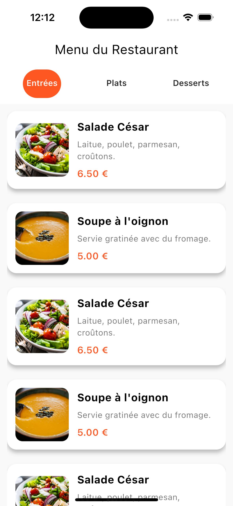
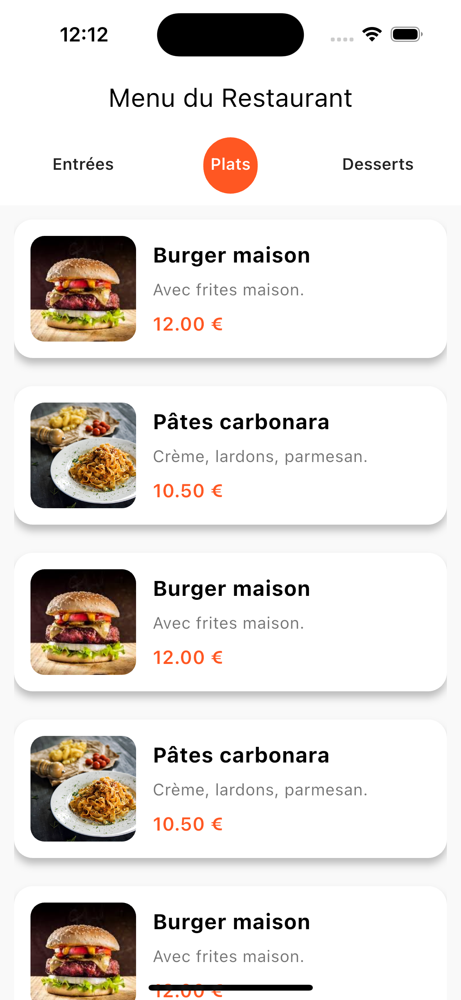
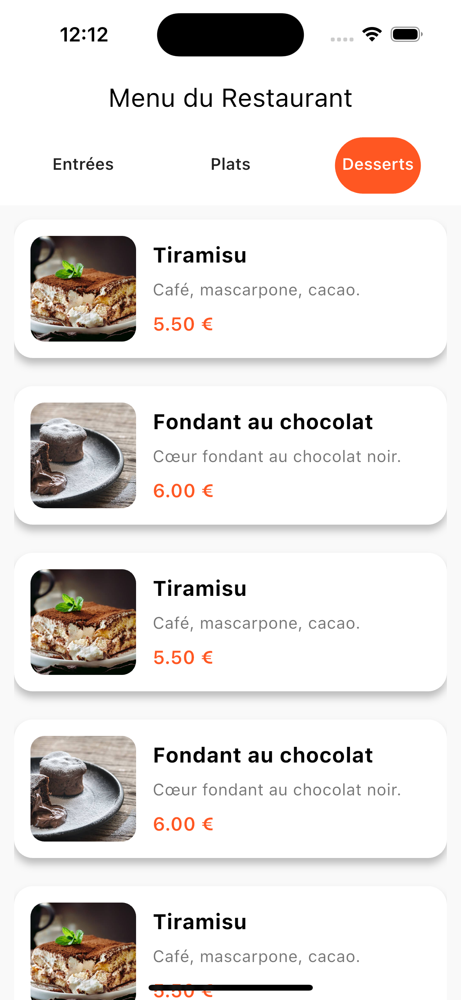

## TD Flutter : Layouts & Scrolls – Menu d’un restaurant

### Screenshots

    
    
    

### Objectifs pédagogiques

- Concevoir une interface structurée à l’aide des layouts Flutter (`Row`, `Column`, `Expanded`, `Card`, etc.).
- Maîtriser l’affichage scrollable vertical et horizontal avec `ListView`.
- Structurer les données sous forme de cartes visuelles réutilisables (composants UI).
- Organiser proprement une interface avec des sections de contenu hiérarchisées.

---

### Contexte du TP

Vous êtes chargé(e) de créer une interface mobile pour afficher le menu d’un restaurant.  
L’application doit permettre à un utilisateur de naviguer facilement dans les différentes catégories de plats proposées et de consulter pour chaque plat une fiche claire et esthétique.

Ce projet mobilise les compétences en construction d’interface avec Flutter tout en découvrant des usages concrets de la disposition imbriquée, des cartes, et des listes scrollables.

---

### Fonctionnalités attendues

1. **Un menu structuré par catégories**

   - Trois catégories visibles en défilement horizontal :
     - Entrées
     - Plats
     - Desserts
   - Présentation sous forme d’onglets, boutons ou étiquettes défilables horizontalement.

2. **Une liste de plats associée à chaque catégorie**

   - Lorsqu’une catégorie est sélectionnée, une liste verticale des plats correspondants doit apparaître.
   - Chaque plat doit être représenté dans une carte (`Card`) contenant :
     - Le nom du plat.
     - Une image illustrative.
     - Le prix du plat.
     - Une courte description (1 ou 2 lignes).

3. **Dispositions attendues**
   - Utilisation de `Column` pour organiser verticalement les composants.
   - Utilisation de `Row` pour la barre de sélection des catégories.
   - Intégration des scrolls verticaux et horizontaux (`ListView`, `ListView.builder` ou `SingleChildScrollView`).
   - Utilisation des `Card` avec `Padding`, `Text`, `Image`, `SizedBox`, `Container` pour soigner la présentation.

---

### Contraintes techniques

- L’application doit fonctionner en mode portrait.
- Les données (plats) peuvent être codées en dur dans une liste dans votre fichier Dart.
- L’affichage doit être responsive et lisible sur un écran de smartphone standard.
- Éviter toute duplication de code (réutiliser des widgets pour les cartes si nécessaire).

---

### Étapes recommandées

1. Créer un projet Flutter de base dans Android Studio.
2. Concevoir la structure générale de l’écran :
   - `AppBar` avec le titre "Menu du Restaurant".
   - Zone de catégories défilable horizontalement.
   - Zone principale contenant les plats affichés sous forme de cartes.
3. Préparer une structure de données pour représenter les plats.
4. Créer un composant visuel pour afficher un plat dans une carte.
5. Mettre en place la logique de sélection de catégorie.
6. Tester l’interface avec différents plats et ajuster le style visuel.

---

### Rendu attendu

- Le fichier principal `main.dart` contenant l’interface fonctionnelle.
- Une capture d’écran de l’interface avec au moins une catégorie sélectionnée et plusieurs plats affichés.
- Commentaires dans le code pour expliquer vos choix de mise en page.
  |
